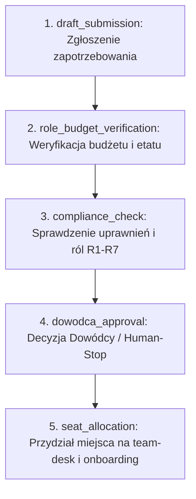

# QUI-88 — ROLE-AUDIT-13: Zespół — wniosek zatrudnienia na team-desk + 5 kroków z business-rules

Date: 2026-09-22  
Linear: [QUI-88](https://linear.app/quietforge/issue/QUI-88/role-audit-13-p2-zespol-wniosek-zatrudnienia-na-team-desk-5-krokow-z)  
Target repo: `dsaas-platform-main`  
GitHub tracking: [workflow-lab#86](https://github.com/wozniaknorbert95-del/workflow-lab/issues/86)  
Scope: **Discovery / Specification in workflow-lab** — zero platform code modification, zero PII, zero deploy.

---

## 1. Kontekst i granice (Lab vs Platforma)

Zgodnie z regułami żelaznymi (`AGENTS.md` §1 oraz `docs/ops/PLATFORM-HITL-BRIDGE.md`):
- `workflow-lab` jest środowiskiem testowym pętli dostarczania; nie zawiera kodu `dsaas-platform-main`.
- Cloud Agent w labie **nie dotyka** repozytorium platformy, nie wykonuje wdrożeń (`deploy = out of scope forever`).
- Zadanie [QUI-88] dotyczy procesu kadrowo-organizacyjnego na platformie: wniosku o zatrudnienie na `team-desk` z zachowaniem 5 kroków deterministycznych zdefiniowanych w `tenancy/tenants/quietforge/business-rules.json`.
- Artefakt w labie dostarcza specyfikację kontraktu (Discovery / Architecture proposal) oraz machine-readable fixtures (schemat wniosku i sekwencja kroków), które po zielonym CI i akceptacji Dowódcy (R7) stanowią podstawę implementacji w osobnym issue/PR na platformie.

---

## 2. 5 kroków wniosku zatrudnienia (`business-rules`)

Proces zatrudnienia (wniosek na `team-desk`) opiera się na 5-stopniowym automacie stanów:

### Opis kroków:
1. **`draft_submission` (Złożenie wniosku)**:
   - Wnioskodawca (lider zespołu / działu) zgłasza zapotrzebowanie na nowe stanowisko na `team-desk`.
   - Wymagane pola: `request_id`, `tenant_id`, `target_team`, `role_title`, `requested_headcount`.
   - Zasada bezwzględna: zero PII kandydata na tym etapie (kandydat jeszcze nieznany lub dane personalne poza schematem technicznym).
2. **`role_budget_verification` (Weryfikacja budżetowa)**:
   - Sprawdzenie limitu etatów oraz progów kosztowych w `business-rules.json` danego tenanta.
   - Weryfikacja, czy dział posiada wolny alokowany budżet i slot na team-desk.
3. **`compliance_check` (Zgodność z architekturą ról)**:
   - Przyporządkowanie stanowiska do matrycy uprawnień i ontologii platformy (np. R1–R7).
   - Blokada nieautoryzowanych uprawnień administracyjnych (fail-closed).
4. **`dowodca_approval` (Bramka Dowódcy — HITL)**:
   - Zgodnie z `PLATFORM-HITL-BRIDGE.md`: zatwierdzenie wniosku kadrowego wymaga jednoznacznej zgody człowieka (Dowódca / R7).
   - Automat nie może samowolnie przejść do onboardingu bez podpisu/decyzji `GO`.
5. **`seat_allocation` (Alokacja stanowiska na team-desk)**:
   - Po zatwierdzeniu przez Dowódcę następuje alokacja identyfikatora stanowiska (`seat_id`) w systemie team-desk oraz przejście wniosku do stanu `approved_allocated`.

---

## 3. Schemat danych wniosku (`hiring-request-schema.json`)

- Identyfikator: `req_<ulid>` unikalny w obrębie `tenant_id`.
- Tenant isolation: pole `tenant_id` jest obowiązkowe we wszystkich zapytaniach i zdarzeniach.
- Zakaz PII: schemat zabrania pól takich jak `pesel`, `nip`, `salary_amount`, `candidate_name`, `phone`, `email`. Kwoty i finanse odwołują się wyłącznie do predefiniowanych pasm płacowych w regułach biznesowych.

---

## 4. Plan testów izolacji i bramkowania (Platform test plan)

Dla implementacji w `dsaas-platform-main`:

| Test ID | Scenariusz | Oczekiwany wynik |
|---------|------------|------------------|
| HR-01 | Złożenie wniosku bez `tenant_id` | **FAIL closed** (walidacja schematu) |
| HR-02 | Próba odczytu wniosku tenant A przez sesję tenant B | **FAIL closed** (404/403, 0 rekordów) |
| HR-03 | Przejście do kroku 5 (`seat_allocation`) z pominięciem kroku 4 (`dowodca_approval`) | **FAIL closed** (nielegalna tranzycja stanu) |
| HR-04 | Próba załączenia pól PII (`candidate_name`, `email`) | **FAIL closed** (odrzucenie payloadu) |
| HR-05 | Złożenie wniosku przekraczającego limit w `business-rules.json` | Odrzucenie na etapie `role_budget_verification` |

---

## 5. Podsumowanie i dalsze kroki

1. **Workflow Lab**:
   - Utworzono specyfikację w `docs/evidence/qui-88-role-audit-13-team-desk.md`.
   - Zarejestrowano schemat w `scripts/fixtures/qui-88/hiring-request-schema.json`.
   - Zarejestrowano definicję 5 kroków w `scripts/fixtures/qui-88/business-rules-steps.json`.
   - Dodano testy spójności w `scripts/test_hermes_ops.py`.
2. **Platforma (`dsaas-platform-main`)**:
   - Wdrożenie kodu store/API dla `team-desk` nastąpi w osobnym issue na platformie po weryfikacji i akceptacji niniejszego discovery przez Dowódcę (R7).
