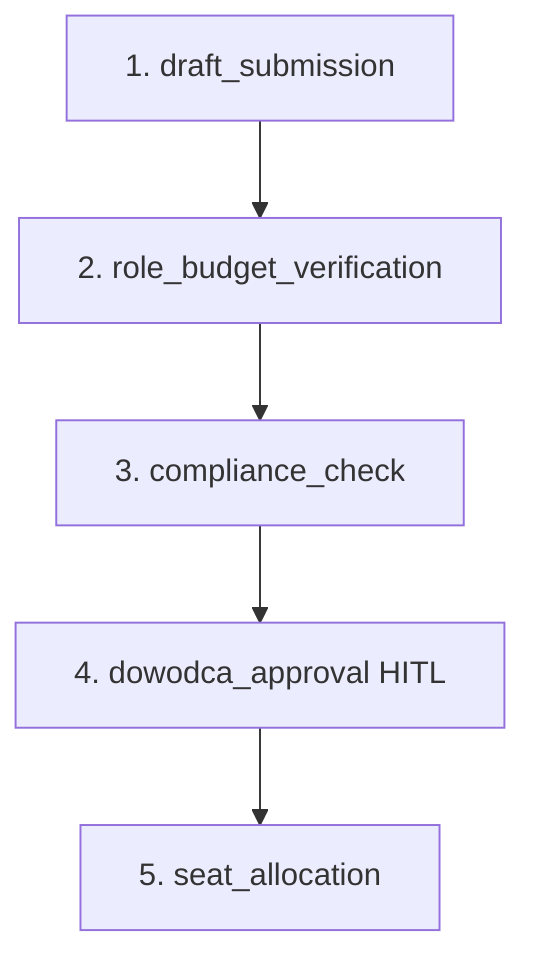

# QUI-88 — ROLE-AUDIT-13: wniosek zatrudnienia na `team-desk` (5 kroków SSoT)

Date: 2026-09-22  
Linear: [QUI-88](https://linear.app/quietforge/issue/QUI-88/role-audit-13-p2-zespol-wniosek-zatrudnienia-na-team-desk-5-krokow-z)  
Parent: [QUI-75](https://linear.app/quietforge/issue/QUI-75/role-audit-qf-rolejob-audit-domkniecie-luk-pracownikow-i-dzialow)  
Depends on owner resolution: [QUI-79](https://linear.app/quietforge/issue/QUI-79/role-audit-04-p1-zespol-konflikt-leadid-owner-vs-hr-stewardb7) (Done)  
Target repo: `dsaas-platform-main`  
GitHub tracking: [workflow-lab#86](https://github.com/wozniaknorbert95-del/workflow-lab/issues/86)

Scope: **lab contract mirror** — discovery fixtures + producer/tests in `workflow-lab`; port to platform runtime/Taca in a follow-up MR on `dsaas-platform-main`. Zero PII, zero deploy.

---

## 1. Kontekst i granice (Lab vs Platforma)

Zgodnie z regułami żelaznymi (`AGENTS.md` §1 oraz `docs/ops/PLATFORM-HITL-BRIDGE.md`):

- `workflow-lab` jest środowiskiem testowym pętli dostarczania; nie zawiera kodu `dsaas-platform-main`.
- Cloud Agent w labie **nie dotyka** repozytorium platformy, nie wykonuje wdrożeń (`deploy = out of scope forever`).
- Artefakt w labie dostarcza specyfikację kontraktu oraz machine-readable fixtures, które po zielonym CI i akceptacji Dowódcy (R7) stanowią podstawę implementacji na platformie.

---

## 2. E0 — delta 5 kroków SSoT vs płyta

| Źródło | Kroki | Uwagi |
| --- | ---: | --- |
| SSoT `business-rules.processes.zespol.zatrudnienie` | **5** | `need_submitted` → `role_defined` → `hr_review` → `owner_acceptance` → `onboarding_gate` |
| `base-plate.json` (krótszy wariant) | **3** | `request` → `owner_acceptance` → `done` — brak `hr_review` i jawnej bramki „no spawn agent” |

Fixture SSoT (producer): `scripts/fixtures/qui-88/zespol-zatrudnienie-ssot-5steps.json`  
Fixture płyta: `scripts/fixtures/qui-88/zespol-zatrudnienie-base-plate-short.json`  
Fixture kontraktu kroków (discovery): `scripts/fixtures/qui-88/business-rules-steps.json`

### Mapowanie koncepcyjne (platforma / business-rules)



---

## 3. Schemat danych wniosku (`hiring-request-schema.json`)

- Identyfikator: `req_<ulid>` unikalny w obrębie `tenant_id`.
- Tenant isolation: pole `tenant_id` jest obowiązkowe we wszystkich zapytaniach i zdarzeniach.
- Zakaz PII: schemat zabrania pól takich jak `pesel`, `nip`, `salary_amount`, `candidate_name`, `phone`, `email`.

---

## 4. Właściciel wniosku (ROLE-AUDIT-04 / QUI-79)

| Rola | Id | Zastosowanie |
| --- | --- | --- |
| Szef wykonawczy Zespołu | `hr-steward` | Producer karty, kroki operacyjne |
| Human-stop akceptacji | `owner` | Akceptacja zatrudnienia na Tacy — **nie** worker id w katalogu |

---

## 5. Producer karty `team-desk` (E1)

Moduł: `scripts/team_desk/employment.py`

Pola wniosku (AC #1): `department`, `position`, `duties_kpi`, `technology`.

Karta Taca (AC #2): `desk=team-desk`, `status=pending`, `labels` zawiera `hitl:approval-required`, `approval_owner=owner`, `producer=hr-steward`.

---

## 6. Approve ≠ spawn agenta (AC #3, E2)

`approve_employment_card()` ustawia `status=approved`, `executed=false`, `decision=employment_accepted_no_runtime_spawn`.  
Test utrzymuje stałą listę agentów runtime (`≤3`) — brak append/spawn.

---

## 7. Plan testów izolacji (platforma)

| Test ID | Scenariusz | Oczekiwany wynik |
|---------|------------|------------------|
| HR-01 | Złożenie wniosku bez `tenant_id` | **FAIL closed** |
| HR-02 | Odczyt wniosku tenant A przez sesję tenant B | **FAIL closed** |
| HR-03 | Przejście do kroku 5 z pominięciem HITL | **FAIL closed** |
| HR-04 | Payload z PII (`candidate_name`, `email`) | **FAIL closed** |
| HR-05 | Wniosek ponad limit w `business-rules.json` | Odrzucenie na weryfikacji budżetu |

---

## 8. Weryfikacja (lab)

```bash
python scripts/test_team_desk.py
python scripts/test_hermes_ops.py
npm run lint && npm test && npm run build
```

---

## 9. Dziennik wykonania (Hermes Ops)

| Etap | Status | Dowód |
| --- | --- | --- |
| E0 delta SSoT vs płyta | Done | fixtures `zespol-zatrudnienie-*`, `test_team_desk.py` |
| E1 producer `team-desk` | Done | `scripts/team_desk/employment.py` |
| E2 no-spawn + EV | Done | `approve_employment_card`, CI `phone-loop-guard` |
| Discovery kontraktu | Done | `business-rules-steps.json`, `hiring-request-schema.json` |

---

## 10. Następny krok (platforma)

Przenieść producer do `runtime/` + test pytest `team-desk` na `dsaas-platform-main` z tym samym kontraktem fixture; merge na platformie po GO / dostępie repo.
