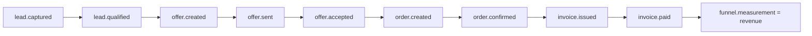

# QUI-89 — ROLE-AUDIT-14 Discovery: `lead_id` → oferta → faktura (most przychodu)

Date: 2026-09-22  
Linear: [QUI-89](https://linear.app/quietforge/issue/QUI-89/role-audit-14-p1-discovery-lead-id-oferta-faktura-jako-most-pomiaru)  
Parent: [QUI-75](https://linear.app/quietforge/issue/QUI-75/role-audit-qf-rolejob-audit-domkniecie-luk-pracownikow-i-dzialow)  
GitHub tracking: [workflow-lab#81](https://github.com/wozniaknorbert95-del/workflow-lab/issues/81)

Scope: **Discovery only** — zero implementacji store w platformie, zero PII, zero deploy.  
Sources (platform SoT, not cloned in this lab run): `docs/ops/QF-ROLE-JOB-AUDIT-2026-09-22.md:180–184`, `docs/ops/QF-D-W4-ANALITYKA-PROPOSAL.md` P1, `tenancy/tenants/quietforge/business-rules.json` → `analityka.funnel` with `measurement: brak` on offer/order/invoice.

## E0 — Pomiar przed

| Obszar | Stan | Skutek |
| --- | --- | --- |
| `analityka.funnel` (offer / order / invoice) | `measurement: brak` | Lejek pokazuje uczciwie brak pomiaru przychodu — nie ma mostu `lead_id` |
| Model `lead_id` | brak | Brak korelacji zdarzeń komercyjnych w jednym łańcuchu |
| ROLE-AUDIT-10 (księga zamówień) | konsument przyszłego mostu | Wymaga spine zanim pomiar gotówki ma sens |

## 1. Minimalny model `lead_id` (bez PII)

**Rekomendacja:** `lead_id` to **tenant-scoped correlation spine**, nie encja „Lead” z danymi kontaktowymi. Nie wymaga Bramki 4.1 ontologii o ile **nie** dodajemy pól PII ani nowego agregatu „Lead”.

### Pola spine (logical record / event payload)

| Pole | Typ | Reguły |
| --- | --- | --- |
| `lead_id` | string | `lead_<ulid>` — opaque, unikalny **w obrębie** `tenant_id` |
| `tenant_id` | string | obowiązkowy na każdym zdarzeniu i dokumencie |
| `lifecycle_state` | enum | `captured` → `qualified` → `offer_active` → `ordered` → `invoiced` → `closed_won` \| `closed_lost` |
| `created_at` | ISO-8601 UTC | moment `lead.captured` |
| `updated_at` | ISO-8601 UTC | ostatnia legalna zmiana stanu |
| `source_channel` | enum | np. `inbound`, `outbound`, `referral`, `unknown` — **bez** nazwisk, emaili, telefonów |
| `measurement_eligible` | boolean | `true` dopiero gdy istnieje powiązana faktura w stanie `issued`/`paid` (patrz mapa zdarzeń) |

**Zakazane pola (L-03 / R7):** `email`, `phone`, `name`, `address`, `nip`, `company_name`, dowolne vol. PII.

### Powiązania dokumentów (graf R2)

Każdy z poniższych nosi ten sam `lead_id` + `tenant_id`:

- **Oferta** (`offer_id`) — opcjonalnie wiele ofert na jeden lead; revenue bridge liczy ścieżkę **wygraną**
- **Zamówienie** (`order_id`) — co najwyżej jedno aktywne zamówienie na wygraną ofertę (edge: anulowanie → `closed_lost`)
- **Faktura** (`invoice_id`) — źródło kwoty przychodu; kwoty **tylko** z istniejącego modelu faktury / `business-rules`, bez nowych progów w Discovery

Machine-readable schema: `scripts/fixtures/qui-89/lead-spine-schema.json`.

## 2. Mapa zdarzeń (offer / order / invoice)

Zdarzenia append-only; pomiar przychodu = agregacja po `invoice.paid` (lub `invoice.issued` jeśli polityka tenantu tak definiuje — decyzja w implementation issue, nie tutaj).

| Event type | Stage | Required keys | Measurement effect |
| --- | --- | --- | --- |
| `lead.captured` | lead | `lead_id`, `tenant_id`, `source_channel` | none |
| `lead.qualified` | lead | `lead_id`, `tenant_id` | none |
| `offer.created` | offer | `lead_id`, `tenant_id`, `offer_id` | none (`measurement: brak` → honest) |
| `offer.sent` | offer | + `sent_at` | none |
| `offer.accepted` | offer | + `accepted_at` | enables order path |
| `offer.declined` | offer | + `declined_at` | may → `closed_lost` |
| `order.created` | order | `lead_id`, `tenant_id`, `order_id`, `offer_id` | none |
| `order.confirmed` | order | + `confirmed_at` | none |
| `order.cancelled` | order | + `cancelled_at` | may → `closed_lost` |
| `invoice.issued` | invoice | `lead_id`, `tenant_id`, `invoice_id`, `order_id`, `amount_net`, `currency` | funnel may show pipeline; **not** revenue until paid policy |
| `invoice.paid` | invoice | + `paid_at` | **revenue counted** for `analityka.funnel` |
| `invoice.voided` | invoice | + `voided_at` | subtract / exclude from revenue |

Fixture: `scripts/fixtures/qui-89/revenue-bridge-event-map.json`.



## 3. Plan testów izolacji tenanta (cross-tenant = FAIL)

Wykonanie w **osobnym issue implementacyjnym** na platformie; Discovery dostarcza plan:

| ID | Scenariusz | Oczekiwany wynik |
| --- | --- | --- |
| TI-01 | Odczyt `lead_id` z kontekstu tenant A | Zero rekordów tenant B |
| TI-02 | Próba zapisu oferty z `lead_id` należącym do tenant B | **FAIL closed** (4xx), brak side-effect |
| TI-03 | Agregacja przychodu bez filtra `tenant_id` | **FAIL closed** / odrzucone zapytanie |
| TI-04 | Payload z polem PII (np. `email`) | **FAIL closed** at ingest |
| TI-05 | Replay eventu z poprawnym `lead_id`, błędnym `tenant_id` | **FAIL closed** |
| TI-06 | API / projekcja Kokpitu — tenant A widzi licznik leads | Wartość nie zmienia się po seedzie tenant B |

**Pass criteria:** wszystkie TI-xx = FAIL closed na cross-tenant; brak wycieku w logach (tylko opaque ids).

## 4. Bramka ontologii 4.1

| Opcja | Opis | 4.1? |
| --- | --- | --- |
| A (zalecana R1) | Correlation spine + FK na istniejących węzłach offer/order/invoice | **Nie** — brak nowego bytu ontologii |
| B | Nowy agregat `Lead` z polami marketingowymi | **Tak** — poza zakresem Discovery |
| C | Zostawić `measurement: brak` | Rollback issue §8 — uczciwy lejek, most odłożony |

## 5. Rekomendacja R1 (jedna, dla Dowódcy / R2 / R7)

**Przyjąć opcję A:** wprowadzić `lead_id` jako tenant-scoped correlation id + mapę zdarzeń powyżej, zaktualizować `analityka.funnel` tak, aby `measurement` przechodziło z `brak` na `revenue` **wyłącznie** po `invoice.paid`, z obowiązkowym filtrem `tenant_id` i testami TI-01..TI-06 przed merge implementacji.

**Następny krok (osobne issue, po PASS Discovery):** implementacja store/event ledger w `dsaas-platform-main`, konsumpcja przez ROLE-AUDIT-10; **bez** deploy z workflow-lab.

## 6. Weryfikacja Discovery (this MR)

- [x] Model + lifecycle + tenant_id
- [x] Mapa zdarzeń offer/order/invoice
- [x] Plan testów izolacji
- [x] Rekomendacja R1 + ścieżka 4.1
- [x] Brak kodu implementacyjnego platformy

```bash
npm run lint && npm test && npm run build
```
